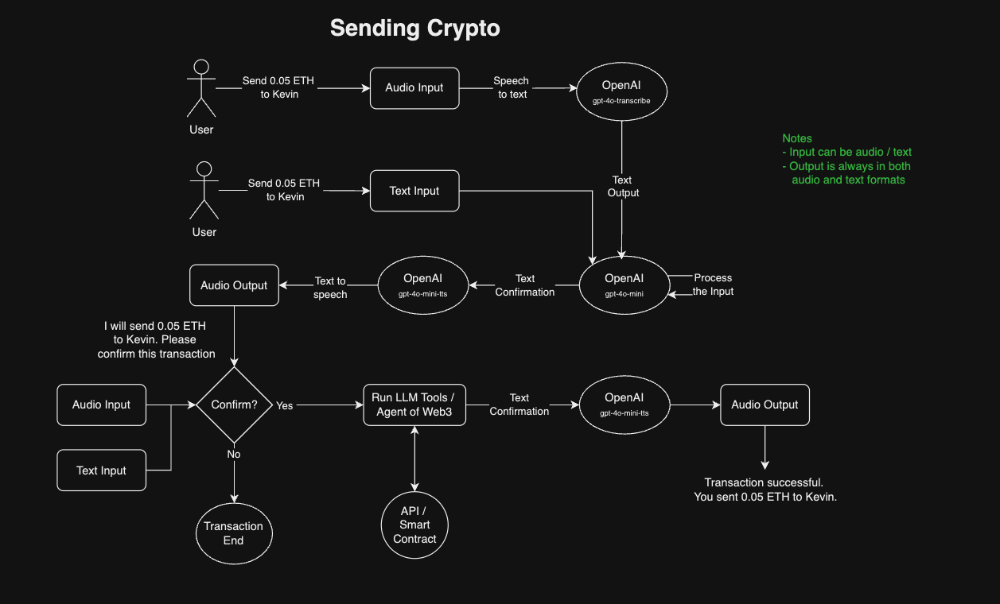
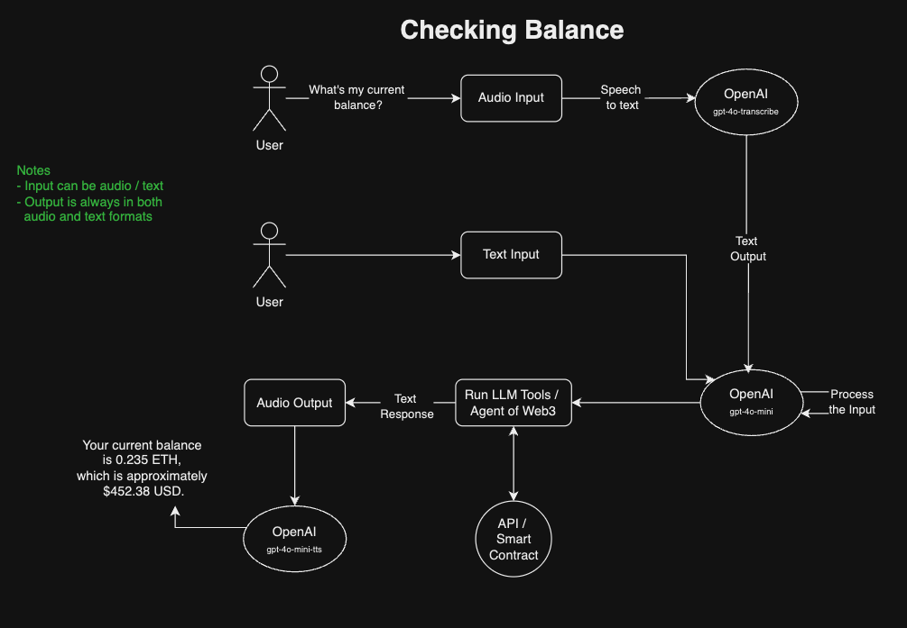
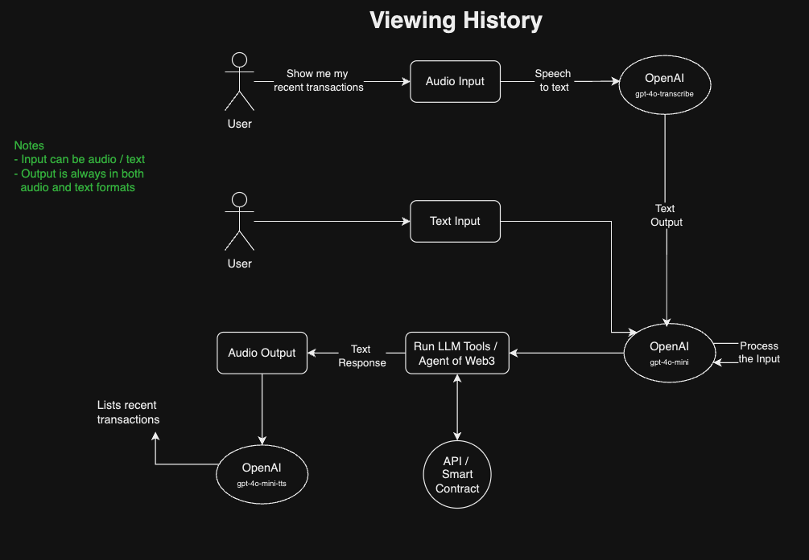

# Technical Specification for Voice Processing

## Considerations
- Limit the maximum audio input to prevent abuse or cost spikes. OpenAI also enforces a maximum limit of 25 MB.

## Tech Stack
- **[Speech to Text](https://platform.openai.com/docs/guides/speech-to-text)**: OpenAI gpt-4o-transcribe
- **[Text to Speech](https://platform.openai.com/docs/guides/speech-to-text)**: OpenAI gpt-4o-mini-tts

## Diagram Flow Overview

## Todo
- [x] Explore OpenAI's gpt-4o-transcribe and gpt-4o-mini-tts.
- [ ] Explore libraries for agent or tool/function calling, either using LlamaIndex.TS or LangChain.js.
  - Reference: LlamaIndex.TS
    - [ ] [Tools](https://docs.llamaindex.ai/en/stable/module_guides/deploying/agents/tools/)
    - [ ] [How to build LLM Agents in TypeScript with LlamaIndex.TS](https://www.llamaindex.ai/blog/how-to-build-llm-agents-in-typescript-with-llamaindex-ts-a88ed364a7aa)
  - Reference: LangChain.js
    - [ ] [Tool calling agent](https://js.langchain.com/v0.1/docs/modules/agents/agent_types/tool_calling/)
    - [ ] [Tool/function calling](https://js.langchain.com/v0.1/docs/modules/model_io/chat/function_calling/)

